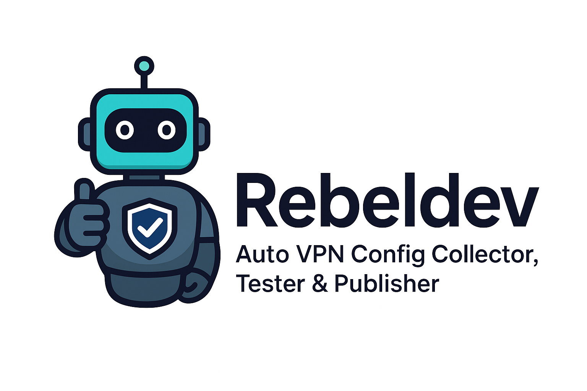

<h1 align="center">
  
  <br>
  🚀 Rebeldev – Free Auto-Updated VPN Configs
</h1>

<p align="center">
  <b>VLESS • VMESS • SS • TROJAN</b><br>
  Updated Every Hour | Tested | Clean | Fast
</p>

---

# 📌 Table of Contents
- [🇮🇷 فارسی](#-فارسی)
- [🇷🇺 Русский](#-русский)
- [🇺🇸 English](#-english)

---

# 🇮🇷 فارسی

## 🚀 Rebeldev چیست؟
یک پروژه متن‌ باز است که به صورت **کاملا خودکار** هر ۱ ساعت کانفیگ‌ های سالم و تست‌ شده VPN را روی پروتکل‌ های زیر جمع‌ آوری و منتشر ‌میکند:

- VLESS  
- VMESS  
- Shadowsocks (SS)  
- Trojan  

تمام کانفیگ‌ های سالم در پوشه‌ ی:  
```

RebelLink/

```

و همچنین روی **GitHub Pages** منتشر میشوند.

---

## ⚙️ سیستم آپدیت خودکار (Auto Update System)

### 🔄 GitHub Actions – actions-user
یک اکانت رباتی به نام **actions-user** هر یک ساعت وظایف زیر را انجام میدهد:

1. جمع‌آوری کانفیگ‌ ها از منابع معتبر  
2. تست سلامت و سرعت  
3. حذف کانفیگ‌ های ضعیف و از کار افتاده  
4. ذخیره خروجی نهایی در پوشه **RebelLink**  
5. انتشار کانفیگ‌ های آپدیت‌ شده روی GitHub Pages  

---

## 📂 ساختار مخزن
```

Rebeldev/
│── RebelLink/        # کانفیگ‌ های ‌بروز و تست‌ شده
│── .github/workflows # سیستم اتوماسیون آپدیت
│── index.html        # گیت‌ پیج
│── README.md         # همین فایل

```

---

# 🇷🇺 Русский

## 🚀 Что такое Rebeldev?
Rebeldev — это открытый проект, который **каждый час автоматически** собирает, проверяет и публикует рабочие VPN-конфигурации:

- VLESS  
- VMESS  
- Shadowsocks (SS)  
- Trojan  

Все живые конфиги находятся в папке:
```

RebelLink/

```

и публикуются через **GitHub Pages**.

---

## ⚙️ Автоматическая система обновления

### 🔄 GitHub Actions – actions-user
Автоматическая система выполняет:

1. Сбор конфигураций  
2. Тестирование стабильности  
3. Удаление нерабочих конфигов  
4. Сохранение итоговых файлов в **RebelLink**  
5. Публикацию через GitHub Pages

## 📂 Структура проекта

```
/.github/
    └── workflows/
RebelLink/
README.md
auto_scanner.py
docs.html
donation.html
index.html
requirements.txt
```

---

## 🛠 Локальный запуск

```bash
git clone https://github.com/Arianlavi/Rebeldev.git
cd Rebeldev
pip install -r requirements.txt
python auto_scanner.py
```

---

## 🤝 Вклад

* Pull Request
* Сообщения об ошибках
* Предложения по улучшению

---

# 🇺🇸 English

## 🚀 What is Rebeldev?
Rebeldev is an open-source project that **automatically updates every hour**, collecting and publishing tested, clean, fast VPN configs:

- VLESS  
- VMESS  
- Shadowsocks (SS)  
- Trojan  

All validated configs are stored in:
```

RebelLink/

```

and also deployed on **GitHub Pages**.

---

## ⚙️ Auto-Update System

### 🔄 GitHub Actions – actions-user
Every hour the automation bot:

1. Collects configuration sources  
2. Tests speed & stability  
3. Removes dead/slow nodes  
4. Saves final configs in **RebelLink**  
5. Deploys them to GitHub Pages  

---

# ⭐ Contribute
PRs, ideas, improvements, and new features are welcome!

---

# ❤️ Credits
- **actions-user** – automated hourly updater  
- Community supporters  

---

<p align="center">
  <b>Made with ⚡ Rebel Power</b>
</p>
